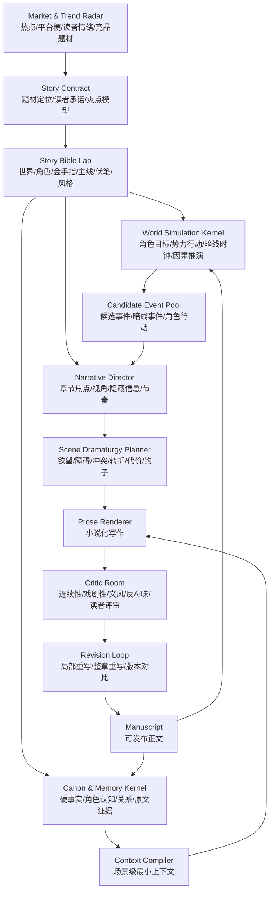

# Story Engine 重构蓝图：从“多 Agent 生成器”到“AI 小说编辑部”

> 本文档记录探索期的理想架构。它不要求兼容当前实现，也不把现有 `backend/frontend/reader` 结构作为约束。  
> 目标是先定义“什么样的系统更可能写出可追更的小说”，再反推模块、数据结构、工作流和后续调研方向。

## 1. 为什么必须重构

当前项目的核心问题不是“某个 Agent 不够聪明”，而是系统范式不对。

现有框架更像一条顺序生产线：

```text
设定 -> 世界推进 -> 剧情规划 -> 视角选择 -> 写作 -> 一致性检查 -> 保存
```

这条线可以生成章节，但很难稳定生成“像人写的小说”。原因是它把小说创作简化成了“给 Writer 足够上下文，让 Writer 写”。实际长篇小说不是信息堆叠问题，而是叙事选择问题、读者体验问题、文风控制问题和持续修订问题。

当前用户反馈的问题可以对应到缺失的系统能力：

| 现象 | 根因 | 重构要解决的能力 |
|---|---|---|
| 上下文一长就偏离 | Writer 直接面对过多历史和设定，缺少场景级上下文编译 | Context Compiler：只给当前场景最小必要上下文 |
| 写得太流水 | 只有事件推进，没有场景戏剧结构 | Scene Dramaturgy：每个场景必须有欲望、障碍、冲突、转折、代价 |
| 不像人写的小说 | 缺少文风指纹、反 AI 味检测和重写循环 | Voice Bible + Style Critic + Revision Loop |
| 没有聚焦效果 | 世界事件和章节焦点没有分权 | Narrative Director：决定本章看什么、不看什么、强调什么 |
| 不能主动获取热点梗 | 创作素材只来自历史设定，缺少外部素材管线 | Trend & Research Radar：热点摄取、转译、过期、审查 |
| 长篇越写越散 | 没有读者承诺、分卷目标和伏笔账本强约束 | Story Contract + Foreshadow Ledger |
| 一致性只能事后补救 | Consistency 是末端检查，不是贯穿式约束 | Canon & Memory Kernel：写前约束、写中引用、写后回写 |

因此，重构的目标不是“多加几个 Agent”，而是把系统从“章节生成器”升级为“AI 小说编辑部”：

```text
市场雷达 + 故事实验室 + 世界沙盘 + 叙事导演 + 写作间 + 编辑部 + 版本管理
```

## 2. 总体原则

### 2.1 小说体验优先于世界模拟

“世界按逻辑运行，摄像头跟拍”是有价值的，但不能作为主框架。

世界模拟能提供可信因果、角色自主性和暗线推进；但如果系统只是跟拍世界事件，输出会像战报、日志、跑团记录，而不是小说。小说的核心不是“世界发生了什么”，而是作者如何选择、隐藏、放大、延迟和重组事件，让读者产生期待、紧张、爽感、共情或震惊。

所以我们保留世界模拟，但把它降级为“素材与约束引擎”：

```text
世界模拟负责：事情为什么会发生。
叙事导演负责：为什么这一章要这样写。
```

### 2.2 Writer 不负责想剧情

Writer 的职责应该窄化：只负责把已经设计好的场景写成小说。

不要让 Writer 同时负责：

- 理解全量世界设定
- 判断历史一致性
- 发明章节冲突
- 决定 POV
- 控制伏笔
- 写正文
- 自我审稿

这会导致随机性过高。正确做法是上游先产出高质量 `SceneCard` 和 `ContextBundle`，Writer 只执行“小说化表达”。

### 2.3 上下文不是越多越好

长篇系统的关键是“选择上下文”，不是“塞更多上下文”。

每个场景只应该给模型：

- 当前场景必须遵守的硬事实
- POV 角色知道/不知道/误会的信息
- 与本场景相关的原文证据
- 上一场景尾部语气
- 本场景戏剧目标
- 本书文风约束
- 禁止写偏的内容

这比把 Bible、所有记忆、所有章节摘要塞进去更稳定。

### 2.4 质量来自评审和重写闭环

一次生成不会稳定产出好小说。系统必须内建“编辑部”：

- 连续性编辑
- 戏剧性编辑
- 文风编辑
- 反流水账检测
- 反 AI 味检测
- 目标读者评审
- 局部重写
- 整章版本对比

最终质量来自 `draft -> evaluate -> revise -> compare -> accept`，不是一次 `generate`。

## 3. 理想系统架构



系统不是单条流水线，而是多个核心内核协作：

| 内核 | 目标 | 产物 |
|---|---|---|
| Market & Trend Radar | 获取外部新鲜素材 | InspirationCard / TrendCard |
| Story Contract | 锁定读者承诺和题材规则 | StoryContract |
| Story Bible Lab | 设计可持续长篇设定 | Bible / Character Registry / Foreshadow Ledger / Voice Bible |
| World Simulation Kernel | 让世界可信运转 | EventPool / WorldTick / CharacterIntent |
| Narrative Director | 做叙事选择 | ChapterPlan / FocusPlan |
| Scene Dramaturgy Planner | 设计戏剧场景 | SceneCard |
| Canon & Memory Kernel | 管理事实、状态、证据 | CanonFact / CharacterMind / TemporalGraph |
| Context Compiler | 编译场景级上下文 | ContextBundle |
| Prose Renderer | 写小说正文 | SceneDraft / ChapterDraft |
| Critic Room | 审稿和评分 | CritiqueReport |
| Revision Loop | 根据审稿重写 | RevisionBrief / RevisedDraft |

## 4. 核心模块设计

### 4.1 Market & Trend Radar：市场和热点雷达

#### 目标

让系统不只依赖训练数据和已有历史设定，而能主动获取最新热点、读者情绪、平台趋势和竞品套路。

#### 重要边界

热点不能直接进入正文，必须先转成“可创作结构”。我们吸收的是情绪、结构和读者期待，不搬运具体表达。

#### 输入

- 搜索趋势
- 新闻热点
- 社媒热梗
- 网文平台榜单
- 小说评论区
- 短视频热门叙事梗
- 竞品简介、标签、读者反馈

#### 输出：`InspirationCard`

```json
{
  "id": "trend_20260426_001",
  "source": "google_trends|weibo|bilibili|qidian|manual",
  "captured_at": "2026-04-26T10:00:00Z",
  "topic": "某类热点",
  "why_it_works": "它触发了什么情绪或期待",
  "reader_emotion": ["爽", "委屈", "反转", "代偿"],
  "portable_pattern": "可迁移的叙事结构",
  "possible_scene_uses": ["开篇钩子", "反派压迫", "主角打脸"],
  "genre_fit": ["都市", "玄幻", "科幻"],
  "copyright_risk": "low|medium|high",
  "forbidden_direct_copy": ["不能照搬的人名、事件、台词"],
  "expires_at": "2026-05-10T00:00:00Z"
}
```

#### 后续调研方向

- AI-friendly search：Tavily、Exa、Perplexity API、Brave Search API。
- 页面抽取：Firecrawl、Jina Reader、trafilatura、readability-lxml。
- 趋势数据：SerpAPI Google Trends、Google Trends RSS、pytrends 替代品、微博/抖音/B 站榜单可用性。
- 竞品分析：起点、番茄、七猫、晋江、飞卢等平台榜单结构和标签体系。
- 版权与安全：热点转译策略、相似度检测、不可直接复用清单。

### 4.2 Story Contract：故事契约

#### 目标

在正式写作前先锁定“这本书向读者承诺什么”。这是最高优先级约束，所有章节规划、场景设计、评审都要引用它。

#### 解决的问题

没有 Story Contract，系统容易只是在“发生事件”，而不是持续兑现读者期待。

#### 输出：`StoryContract`

```json
{
  "target_reader": "目标读者画像",
  "genre": "题材",
  "subgenre": "细分类型",
  "reader_promise": "读者为什么追更",
  "core_pleasures": ["爽点", "悬念", "情绪代偿", "成长感"],
  "chapter_default_deliverables": ["每章至少交付的体验"],
  "protagonist_appeal": "主角长期吸引力",
  "forbidden_drift": ["不能变成的样子"],
  "pacing_profile": {
    "hook_frequency": "每章",
    "minor_payoff_frequency": "1-2章",
    "major_payoff_frequency": "5-8章"
  }
}
```

#### 后续调研方向

- 网文类型学：男频、女频、短剧、轻小说、无限流、克苏鲁、赛博修仙等类型规则。
- 读者留存机制：章节钩子、期待差、爽点密度、反转间隔。
- 商业小说写作理论：Save the Cat、K.M. Weiland 角色弧、Brandon Sanderson 写作课。
- 国内平台编辑建议和公开写作课。

### 4.3 Story Bible Lab：故事实验室

#### 目标

把 Bible 从“一次生成的 JSON”升级成“可迭代的创作资产库”。

#### 核心资产

- `WorldRules`：世界规则和限制。
- `PowerSystem`：金手指、能力、代价、升级路径。
- `CharacterRegistry`：角色静态设定。
- `CharacterArcPlan`：角色长期变化。
- `FactionRegistry`：势力目标、资源、行动风格。
- `PlotSpine`：主线和分卷目标。
- `ForeshadowLedger`：伏笔账本。
- `VoiceBible`：文风指纹。
- `AntiPatternBook`：本书禁止套路和 AI 味清单。

#### 输出示例：`ForeshadowLedger`

```json
{
  "thread_id": "thread_shadow_king",
  "type": "mystery|promise|relationship|world_rule",
  "planted_at": 3,
  "current_status": "active|mutated|paid_off|abandoned",
  "visible_to_reader": true,
  "known_by_characters": ["char_a"],
  "planned_payoff_window": [12, 18],
  "payoff_requirement": "回收时必须改变主角处境",
  "related_evidence": ["ch3_p12", "ch5_p02"]
}
```

#### 后续调研方向

- 小说设定管理工具：World Anvil、Campfire、Obsidian 小说模板。
- SillyTavern character card / lorebook 生态。
- NovelAI lorebook、作者注、记忆机制。
- Scrivener / Ulysses / Notion 创作工作流。

### 4.4 World Simulation Kernel：世界沙盘

#### 目标

保留“世界按逻辑运行”的优势，让角色、势力、暗线在主角视野外持续推进。

#### 设计原则

世界模拟只生成候选事件和状态变化，不直接决定正文。

```text
世界沙盘：负责因果可信。
叙事导演：负责选择和表达。
```

#### 核心实体

- `Actor`：角色或势力。
- `Goal`：长期目标和短期目标。
- `Resource`：资源、情报、关系、地盘。
- `Constraint`：规则、代价、限制。
- `WorldClock`：全局倒计时。
- `OffscreenAction`：视野外行动。
- `EventCandidate`：可被叙事层选用的事件。

#### 输出：`EventCandidate`

```json
{
  "event_id": "evt_001",
  "chapter_window": [8, 10],
  "actors": ["char_antagonist", "faction_black_tower"],
  "cause": "反派资源不足，必须提前夺取遗物",
  "event": "黑塔派出内线试探主角",
  "consequences": ["主角暴露能力边界", "配角信任被动摇"],
  "visibility": {
    "reader": "hidden|partial|clear",
    "known_by": ["char_antagonist"]
  },
  "dramatic_potential": {
    "conflict": 0.8,
    "surprise": 0.6,
    "payoff": 0.4
  }
}
```

#### 对“摄像头跟拍”的反驳和保留

“摄像头跟拍”如果按字面执行，会导致系统记录世界而不是创作小说。应改成：

- 不叫 Camera Agent。
- 改为 `Narrative Director` 或 `Focalization Agent`。
- 它不是客观镜头，而是叙事选择器。

#### 后续调研方向

- 多 Agent 模拟：Generative Agents、AI Town、Voyager、MetaGPT 类项目。
- 叙事模拟：StoryBox、interactive fiction、text adventure planning。
- 游戏 AI：GOAP、行为树、utility AI、simulation tick。
- 因果图和事件图：event graph、planning graph、temporal planning。

### 4.5 Narrative Director：叙事导演

#### 目标

从世界沙盘和故事契约中选择“本章怎么写才好看”。

#### 输入

- StoryContract
- PlotSpine
- ForeshadowLedger
- EventCandidatePool
- 当前读者期待
- 当前角色状态
- 上章结尾

#### 输出：`ChapterFocusPlan`

```json
{
  "chapter_num": 12,
  "chapter_question": "主角能否在不暴露金手指的情况下救下同伴？",
  "reader_emotion_target": ["紧张", "代偿", "小爽"],
  "primary_pov": "char_protagonist",
  "focus_events": ["evt_001", "evt_004"],
  "hidden_events": ["evt_002"],
  "foreshadow_to_advance": ["thread_shadow_king"],
  "payoff_to_deliver": ["thread_minor_debt"],
  "ending_hook": "主角以为脱身，实际被更高层注意到",
  "do_not_write": ["不要解释反派完整计划", "不要让主角无代价获胜"]
}
```

#### 后续调研方向

- 叙事焦点/focalization 理论。
- 悬疑写作的信息差设计。
- 网文章节钩子和付费点。
- 多 POV 长篇小说结构。
- StoryWriter 的 event-based outline 和 chapter planning。

### 4.6 Scene Dramaturgy Planner：场景戏剧设计

#### 目标

解决“流水账”。每个场景必须是一个戏剧单元，不是事件摘要。

#### 输出：`SceneCard`

```json
{
  "scene_id": "ch12_s2",
  "pov": "char_protagonist",
  "location": "废弃车站",
  "scene_focus": "主角试图救人但不能暴露能力",
  "desire": "救下同伴",
  "obstacle": "敌人逼迫他公开能力来源",
  "opposition": "黑塔内线",
  "information_gap": "读者知道同伴可能已背叛，主角不知道",
  "turning_point": "主角发现敌人真正目标不是同伴，而是他的反应",
  "cost": "主角救人成功但失去隐藏身份的余地",
  "emotional_shift": "冷静 -> 焦躁 -> 冷硬",
  "required_payoff": "回收第9章欠下的人情",
  "ending_hook": "同伴醒来后说出不该知道的暗号",
  "forbidden": ["不要复述世界设定", "不要让角色站着解释动机"]
}
```

#### 后续调研方向

- Scene/Sequel 写作理论。
- Goal-Conflict-Disaster / Reaction-Dilemma-Decision。
- Save the Cat beat sheet。
- 短剧强冲突结构。
- 人工抽样分析高订章节，提取场景结构模板。

### 4.7 Canon & Memory Kernel：正典和记忆内核

#### 目标

解决长篇一致性、角色认知、伏笔回收、上下文检索失真。

#### 记忆分层

| 层级 | 名称 | 内容 | 用法 |
|---|---|---|---|
| L0 | Story Identity | 本书定位、读者承诺、主角吸引力 | 永远加载 |
| L1 | Essential Canon | 最高优先级硬事实、主线现状、关键伏笔 | 每章加载 |
| L2 | Room Recall | 当前角色/地点/势力/伏笔相关内容 | 场景触发 |
| L3 | Deep Evidence Search | 原文证据、相似场景、历史细节 | 需要时深搜 |

这里借鉴 MemPalace 的 4 层记忆和 wing/room/drawer 思想，但领域化为小说：

```text
wing = story
room = character / location / faction / thread / object
hall = facts / events / emotions / relationships / style / evidence
drawer = 原文片段或结构化事实
```

#### 必须区分的记忆类型

- `CanonFact`：硬事实，不能错。
- `CharacterMind`：某角色知道什么、误会什么、隐瞒什么。
- `RelationshipState`：关系强度、债务、敌意、信任。
- `WorldState`：地点、势力、资源、时间。
- `EvidenceChunk`：原文章节片段。
- `StyleExample`：本书可模仿的文风样例。
- `ForeshadowState`：伏笔生命周期。

#### 后续调研方向

- MemPalace：分层记忆、元数据范围过滤、agent diary。
- Graphiti/Zep：temporal graph、episode provenance、hybrid retrieval。
- Mem0、Letta/MemGPT、LangMem。
- RAG 检索评测：LongMemEval、LoCoMo、MemBench。
- 自建评测集：角色事实问答、伏笔回收问答、章节证据定位。

### 4.8 Context Compiler：场景级上下文编译器

#### 目标

在写作前，为每个场景编译最小必要上下文，避免长上下文污染写作。

#### 输出：`ContextBundle`

```json
{
  "story_contract": "本书读者承诺和本章体验目标",
  "hard_constraints": ["硬事实1", "硬事实2"],
  "pov_knowledge": {
    "knows": ["主角知道的信息"],
    "does_not_know": ["主角不能知道的信息"],
    "misbelieves": ["主角误以为的信息"]
  },
  "scene_relevant_evidence": [
    {"chapter": 8, "quote": "原文证据片段", "reason": "用于保持关系连续性"}
  ],
  "voice_constraints": ["句式节奏", "对白规则", "禁用词"],
  "continuity_tail": "上一场景或上一章末尾",
  "do_not_include": ["不能泄露反派计划", "不要重复第7章桥段"]
}
```

#### 后续调研方向

- Context engineering。
- Prompt assembly / prompt routing。
- SillyTavern Prompt Manager 的插入顺序、角色、深度。
- Token budgeting 算法。
- RAG reranking 和 evidence selection。

### 4.9 Prose Renderer：小说化渲染器

#### 目标

只负责把 SceneCard + ContextBundle 写成小说，不负责规划。

#### 支持多种写作模式

- 男频爽文：强目标、强压迫、强反击。
- 悬疑：信息差、误导、线索密度。
- 都市情绪文：关系张力、对白潜台词。
- 轻小说：角色互动、吐槽、节奏轻快。
- 文学感：留白、意象、句法变化。
- 短剧：强钩子、高密度冲突。

#### 输出

可以一次生成多个候选：

```json
{
  "scene_id": "ch12_s2",
  "candidates": [
    {"id": "a", "text": "...", "style_notes": "..."},
    {"id": "b", "text": "...", "style_notes": "..."}
  ]
}
```

然后由 Critic Room 选择、融合或要求重写。

#### 后续调研方向

- AI slop 检测项目。
- 文风指纹：句长、词频、比喻密度、对白比例。
- 中文网文语料风格分析。
- 多候选 self-consistency / best-of-n。
- 局部重写算法：只改问题段，不重写整章。

### 4.10 Critic Room：编辑部

#### 目标

让质量控制成为主流程，而不是最后一道一致性检查。

#### 编辑角色

| 编辑 | 检查对象 |
|---|---|
| Continuity Editor | 硬事实、时间线、角色认知、能力边界 |
| Drama Editor | 场景是否有冲突、转折、代价、钩子 |
| Style Editor | 是否符合 VoiceBible，是否有 AI 腔 |
| Pacing Editor | 节奏是否拖沓，是否信息密度过低 |
| Reader Panel | 目标读者是否想追下一章 |
| Market Editor | 是否兑现题材和爽点承诺 |

#### 输出：`CritiqueReport`

```json
{
  "overall_score": 7.2,
  "must_fix": [
    {
      "type": "drama",
      "location": "scene_2",
      "problem": "主角没有付出代价，胜利太平",
      "revision_instruction": "加入一个短期失败或关系损失"
    }
  ],
  "should_fix": [],
  "do_not_change": ["scene_1 的开场钩子有效，保留"],
  "reader_reaction": {
    "boredom_risk": 0.3,
    "continue_reading_intent": 0.75,
    "expected_next": "想知道同伴为什么知道暗号"
  }
}
```

#### 后续调研方向

- autonovel 的 evaluation/revision/review loop。
- LLM-as-judge 可靠性。
- Pairwise Elo 章节候选评比。
- 人工读者小组模拟。
- 自动指标：重复率、抽象词密度、对白比例、转折密度、解释段长度。

### 4.11 Revision Loop：修订循环

#### 目标

把 Critic Report 转成可执行的重写任务。

#### 工作流

```text
Draft -> CritiqueReport -> RevisionBrief -> Rewrite -> Compare -> Accept/Retry
```

#### 重写粒度

- 单句润色
- 段落重写
- 场景重写
- 场景顺序调整
- 整章重写
- 分卷结构调整

#### 后续调研方向

- Diff-aware rewriting。
- 编辑指令跟随评测。
- 自动保留有效段落。
- 版本树和回滚。
- 人类编辑介入点设计。

## 5. 推荐技术架构

如果完全重构，建议技术底座如下：

| 层 | 推荐 |
|---|---|
| 后端 API | FastAPI 或 Litestar |
| 工作流 | LangGraph / Temporal / Prefect，初期 LangGraph 足够 |
| 主数据库 | PostgreSQL |
| 向量检索 | pgvector 起步；规模变大后 Qdrant |
| 全文检索 | Postgres FTS / Meilisearch |
| 图谱 | 初期 Postgres temporal tables 自研；后期 Graphiti/Neo4j/Kuzu |
| 对象存储 | 本地文件 / S3 compatible |
| 前端 | Next.js 创作工作台 |
| 观测 | 所有 prompt、上下文、模型、版本、评分、重写理由可追踪 |

### 为什么不一开始上 Neo4j/Graphiti

Graphiti 很强，但会引入图数据库、LLM schema extraction、额外运维和成本。探索期最重要的是快速验证创作质量闭环。建议先用 Postgres 做轻量 temporal graph：

```text
entities
facts
fact_validity
episodes
evidence_chunks
character_mind
```

当我们确认图检索成为瓶颈，再评估 Graphiti。

## 6. 产品工作区设计

理想前端不应该只是 dashboard，而是创作工作台。

### 6.1 创意雷达

- 热点列表
- 竞品榜单
- 读者评论聚类
- 梗/桥段素材池
- InspirationCard 审核
- 素材过期和屏蔽

### 6.2 故事实验室

- Story Contract
- Story Bible
- 角色注册表
- 势力表
- 金手指规则
- 分卷大纲
- 伏笔账本
- 文风样章

### 6.3 世界沙盘

- 世界时钟
- 势力行动
- 角色意图
- 暗线倒计时
- 候选事件池
- 事件因果图

### 6.4 章节导演台

- 本章问题
- 读者情绪目标
- POV 选择
- 信息隐藏策略
- 场景卡
- 章节钩子

### 6.5 写作间

- 场景正文候选
- 多版本对比
- 局部重写
- 文风调节
- 人工编辑批注

### 6.6 编辑部

- 连续性报告
- 戏剧性报告
- 风格报告
- 读者小组报告
- 反 AI 味报告
- 修订任务列表

## 7. 最小可行重构路线

### Phase 0：建立评测基线

先不要重写全部系统，先定义“什么是更好”。

产物：

- 10 个目标章节样本。
- 10 个失败章节样本。
- 质量评分表。
- 人工标注问题：流水、偏离、AI 味、无冲突、设定错误。
- 自动指标初版。

### Phase 1：核心闭环 MVP

只做 6 个模块：

1. Story Contract
2. Scene Card
3. Context Compiler
4. Prose Renderer
5. Critic Room
6. Revision Loop

目标：同样的大纲，生成章节明显不流水、更聚焦、更像小说。

### Phase 2：记忆内核重构

新增：

- CanonFact
- CharacterMind
- EvidenceChunk
- ForeshadowLedger
- Temporal relationship state
- Context Inspector

目标：长篇写到 30-50 章仍然不明显偏离。

### Phase 3：世界沙盘

新增：

- Actor goals
- Faction plans
- World clocks
- Offscreen actions
- Event candidate pool

目标：世界和配角不围着主角转，暗线有持续推进。

### Phase 4：外部素材和热点雷达

新增：

- Trend ingestion
- InspirationCard
- Competitor analysis
- Reader comment mining
- Copyright-safe transformation

目标：题材和桥段能吸收新鲜趋势，但不照搬。

### Phase 5：完整编辑部

新增：

- 多候选 Elo 对比
- 读者小组模拟
- 全书级审稿
- 分卷重构建议
- 商业化发布指标

目标：从“能生成章节”进入“能持续打磨作品”。

## 8. 证据来源和可借鉴点

### 8.1 MemPalace

- 仓库：https://github.com/MemPalace/mempalace
- 官方文档：https://mempalaceofficial.com/
- 重点页面：
  - Memory Stack：https://mempalaceofficial.com/concepts/memory-stack.html
  - Knowledge Graph：https://mempalaceofficial.com/concepts/knowledge-graph.html
  - Specialist Agents：https://mempalaceofficial.com/concepts/agents.html

可借鉴：

- L0/L1/L2/L3 分层记忆。
- wing/room/hall/drawer 的范围化检索。
- 原文 verbatim storage，而不是只存摘要。
- SQLite temporal knowledge graph 的轻量思路。
- agent diary：每个专业 Agent 维护自己的长期观察。

谨慎点：

- 官方 README 提醒存在仿冒域名；用户给出的 `milla-jovovich/mempalace` 当前重定向到 `MemPalace/mempalace`，应以官方仓库和官方文档为准。
- 不建议直接全量接入，应该吸收思想并领域化到小说。

### 8.2 SillyTavern

- 仓库：https://github.com/SillyTavern/SillyTavern
- World Info 文档：https://docs.sillytavern.app/usage/core-concepts/worldinfo/
- Prompt Manager 文档：https://docs.sillytavern.app/usage/prompts/prompt-manager/
- Prompts 文档：https://docs.sillytavern.app/usage/prompts/

可借鉴：

- World Info / Lorebook 动态注入。
- keyword、regex、vector 三类触发。
- character/persona/chat 多上下文绑定。
- prompt 插入顺序、位置、role、depth 控制。
- Prompt Inspector 思路：让用户看到最终上下文为什么这么组装。

谨慎点：

- SillyTavern 是强交互聊天/角色扮演前端，不是长篇小说生产系统。
- 不建议嵌入它作为核心，只应借鉴 lorebook 和 prompt assembly。

### 8.3 NousResearch/autonovel

- 仓库：https://github.com/NousResearch/autonovel

可借鉴：

- foundation -> draft -> evaluation -> revision -> review 的完整闭环。
- `voice.md`、`canon.md`、`ANTI-SLOP.md`、`ANTI-PATTERNS.md` 等创作资产。
- mechanical slop scorer、LLM judge、reader panel、revision brief。
- 完整作品不是一次生成，而是多轮自动评审和修订。

谨慎点：

- 它更偏自动 pipeline，交互式创作工作台不是重点。
- 我们应借鉴“编辑闭环”和“文风/反 AI 味资产”，不必复制产物链路。

### 8.4 Graphiti / Zep

- 仓库：https://github.com/getzep/graphiti
- Zep Open Source 页面：https://www.getzep.com/product/open-source/
- 论文：https://arxiv.org/abs/2501.13956

可借鉴：

- temporal context graph。
- episodes/provenance：所有事实可回溯到原始证据。
- hybrid retrieval：semantic + keyword + graph traversal。
- 自动事实失效和历史查询。

谨慎点：

- 引入图数据库和额外服务，探索期运维复杂。
- 短期建议自研轻量 temporal graph，后期再迁移。

### 8.5 StoryWriter

- 论文：https://arxiv.org/abs/2506.16445

可借鉴：

- event-based outline。
- chapter planning。
- dynamic compression of story history。
- 关注 discourse coherence 和 narrative complexity。

### 8.6 CONCOCT / Long-form pacing

- 论文：https://arxiv.org/abs/2311.04459

可借鉴：

- 长篇规划的 pacing 问题可以被显式评估。
- 事件“具体度”可作为大纲展开和节奏控制指标。

### 8.7 CreAgentive

- 论文：https://arxiv.org/abs/2509.26461

可借鉴：

- 初始化、生成、写作三阶段。
- 长短期目标共同指导 creative generation。
- 明确评估 narrative indicators。

### 8.8 Tavily

- Python SDK 仓库：https://github.com/tavily-ai/tavily-python
- Agent Skills 文档：https://docs.tavily.com/documentation/agent-skills

可借鉴：

- AI-friendly search。
- search/extract/crawl/map/research 一体化。
- 适合作为 Market & Trend Radar 的搜索层。

### 8.9 Firecrawl

- 仓库：https://github.com/mendableai/firecrawl
- 文档：https://docs.firecrawl.dev/

可借鉴：

- 把网页转成 LLM-ready markdown。
- 支持结构化 JSON 抽取。
- 支持 crawl/map/agent 多页抽取。

### 8.10 SerpAPI / Google Trends

- SerpAPI Python 仓库：https://github.com/serpapi/serpapi-python
- Google Trends API 文档：https://serpapi.com/google-trends-api

可借鉴：

- 搜索趋势、相关查询、地区热度。
- 适合趋势入口，但要注意成本和 API 限制。

### 8.11 pytrends

- 仓库：https://github.com/GeneralMills/pytrends

可借鉴：

- Google Trends 非官方接口形态。
- 可用于原型试验。

谨慎点：

- 它明确是 unofficial API，稳定性和限制不可控，不应作为生产核心依赖。

## 9. 后续应该如何继续调研

后续调研不应该只搜“AI 写小说”。应该按模块拆开，每个模块找最强实践。

### 9.1 记忆和上下文

搜索方向：

- AI agent long-term memory
- temporal knowledge graph agent memory
- context engineering LLM
- hybrid retrieval graph vector keyword
- memory benchmark LongMemEval LoCoMo MemBench

候选项目：

- MemPalace
- Graphiti
- Mem0
- Letta / MemGPT
- LangMem
- Zep

验证方法：

- 自建 100 个小说连续性问答。
- 检索必须返回原文证据。
- 测试 10/30/50/100 章后角色事实是否稳定。

### 9.2 叙事规划和节奏

搜索方向：

- long-form story generation planning
- event based outline story generation
- pacing long-form story planning
- narrative planning AI
- plot graph generation

候选资料：

- StoryWriter
- CONCOCT
- CreAgentive
- Save the Cat beat sheet
- Scene/Sequel theory

验证方法：

- 标注好章节的“章节问题、场景目标、转折、钩子”。
- 比较有无 SceneCard 的输出差异。
- 做读者继续阅读意愿评分。

### 9.3 文风和反 AI 味

搜索方向：

- AI slop detector
- LLM writing style fingerprint
- stylometry sentence length lexical diversity
- literary style transfer LLM
- prose revision agent

候选资料：

- autonovel 的 ANTI-SLOP / ANTI-PATTERNS 思路。
- EQ-Bench slop score。
- stylometry 工具链。

验证方法：

- 构建中文 AI 味坏样本库。
- 指标：重复短语、抽象形容词、解释段比例、句式单调、无动作对白。
- 人工 A/B 盲评。

### 9.4 热点和外部素材

搜索方向：

- AI search API RAG
- web extraction for LLM
- Google Trends API alternatives
- social trend analysis API
- copyright safe inspiration generation

候选工具：

- Tavily
- Firecrawl
- SerpAPI
- Brave Search
- Exa
- Jina Reader
- trafilatura

验证方法：

- 每日自动生成 20 张 InspirationCard。
- 人工评估：可用性、新鲜度、侵权风险。
- 测试热点卡是否能改进开篇钩子和章节桥段。

### 9.5 角色和世界模拟

搜索方向：

- generative agents simulation
- AI town agents
- GOAP game AI planning
- utility AI behavior tree
- multi-agent world simulation narrative

候选项目/资料：

- Generative Agents paper。
- AI Town 类项目。
- 游戏 AI 行为树和 GOAP。
- Interactive fiction planning。

验证方法：

- 角色离开主角视野后仍有行动记录。
- 反派计划能被世界状态驱动，而不是每章临时编。
- 沙盘事件必须被 Narrative Director 二次选择后才进入正文。

### 9.6 编辑和评审

搜索方向：

- LLM as judge writing evaluation
- pairwise evaluation Elo LLM
- automated fiction critique
- revision brief generation
- reader persona evaluation

候选资料：

- autonovel review loop。
- LLM-as-judge 评测论文。
- RLAIF / pairwise preference ranking。

验证方法：

- 每章至少 2 个候选版本做 pairwise。
- Critic Report 必须能转成可执行 RevisionBrief。
- 重写后必须证明问题减少，而不是只变长。

## 10. 决策摘要

如果完全重构，推荐方向如下：

1. 不再以“六 Agent 固定流水线”为核心。
2. 以“AI 小说编辑部”为核心产品形态。
3. 保留世界模拟，但它只生成可信候选事件。
4. 把 Camera Agent 升级为 Narrative Director。
5. 把 Writer 降级为 Prose Renderer，只负责小说化表达。
6. 用 SceneCard 解决流水账。
7. 用 Context Compiler 解决长上下文偏离。
8. 用 Canon & Memory Kernel 解决长篇一致性。
9. 用 Critic Room + Revision Loop 解决不像人写。
10. 用 Trend Radar 解决新鲜感和热点吸收。

最终目标不是“AI 自动写完一本书”，而是：

```text
AI 编辑部能够持续设计、写作、评审、重写和打磨一本读者愿意追更的小说。
```

