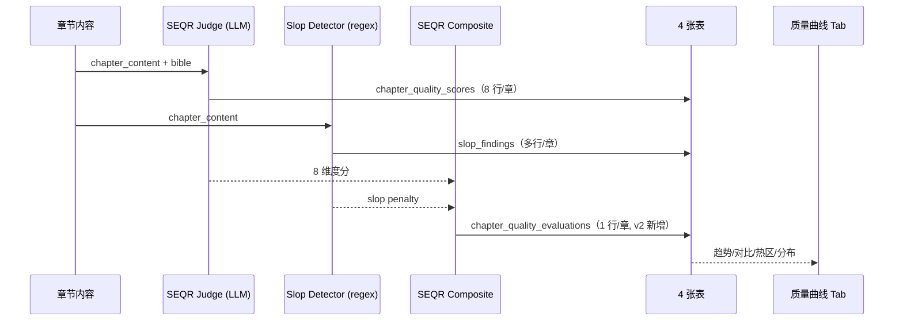

# Proposal: Phase 0 · 中文小说自动评测基线 (v2)

> ⚠️ **SUPERSEDED 2026-04-27 by `phase-gate.md` v2.2**（详见 `change-log.md`）。
> 本 proposal 是 v2 提案的历史快照，文中 "24 章 / 192 分 / 100+50 human-normal"
> 等表述已不再代表当前 phase-gate。任何冲突以 `phase-gate.md` v2.2 为准：
> - 实际 scope 由 `evaluation_batches.scope_chapter_count` 动态决定（基线 batch = 21 章）
> - AC3 sample 已升级为 100 slop + 50 generic-normal + 50 fiction-normal（v3 schema）
> - Detector 版本 `slop-v1`，单一源（`backend/quality/slop_detector.py`）
> 本文件保留以审计 v2 当时的论证逻辑，不再驱动开工。

| Field | Value |
|---|---|
| Author | engineer (Claude) |
| Date | 2026-04-26 |
| Version | v2（已被 phase-gate v2.2 取代）|
| Status | superseded |
| Scope | Phase 0 of rearchitecture |
| Decision needed | no（已开工，按 phase-gate v2.2 推进） |
| Deadline | n/a（已 greenlit，2026-04-26 phase-0-greenlight） |
| Companion | `phase-gate.md` v2.2（当前契约） |
| Supersedes | v1 |
| Superseded by | `phase-gate.md` v2.2（2026-04-27 Report #4 review） |

## One-Sentence Goal

把"小说写得好不好"从主观感受升级为**项目本地的可重复测量数字基线（SEQR v0）**，使后续 Phase 在 24 章历史数据上做内部纵向对比。

## Why Now

1. **Standing decision `process-001`** 强制要求 baseline / sample / method / cost / rollback。
2. **当前调试盲区**：现有 prompt 已迭代 3 个月但每次改动无法证伪。
3. **后续 Phase 的前置依赖**：没有基线，"提升 ≥X%" 失去意义。
4. **沉没成本止血**：评测器一次建好，跑全量 ¥1.2-3。不建评测的代价是工程师每周凭感觉调 prompt。

## Why v2 改命名

v1 错误地直接套用论文名（WebNovelBench / HNES），监督审出 7 个 blocking findings。v2 修正：

| 维度 | v1（错） | v2 ✓ | 改正依据 |
|---|---|---|---|
| Rubric 命名 | "WebNovelBench 8 维度" | **SEQR v0**（项目本地） | WebNovelBench 真实维度名是 Literary Devices / Sensory Detail / Character Presence / Dialogue Distinctiveness / Characterisation Consistency / Atmospheric & Thematic Alignment / Contextual Appropriateness / Scene-to-Scene Coherence [verified:2026-04-26:https://arxiv.org/html/2505.14818]，与 v1 名字完全不一致 |
| 聚合公式 | "HNES = (Sq+Sl)/2 - slop" | **SEQR Composite = mean(8) - slop** | HNES 是 CreAgentive 概念 [verified:2026-04-26:https://arxiv.org/html/2509.26461]，需要 human eval（Vd = 0.5×auto + 0.5×human），我们没有该 pipeline |
| 维度数 | 8（命名错） | 8（重新设计） | 借鉴 WebNovelBench D1/D2/D4/D5/D8 + autonovel anti-slop + 中文本地化 |

## Proposed Change

实现 `backend/quality/` 模块（4 个文件）+ `data/baselines/` 数据 + 1 个前端 Tab + 跑全 24 章基线评分入库。

## Non-Goals

详见 `phase-gate.md`，重点 4 项：

- ❌ 不优化任何写作 prompt（属 Phase 1）
- ❌ 不接入 chapter_graph 自动评测（Phase 0 离线脚本即可，Phase 1 再集成）
- ❌ 不和 WebNovelBench 公开 leaderboard 对齐分数（仅做内部纵向 baseline）
- ❌ 不冒用论文命名（rubric 命名为 SEQR v0）

## Design

### 三个核心组件

#### (1) SEQR v0 LLM 评测器 `backend/quality/seqr_judge.py`

8 维度（含中文场景定义）：

| Key | 中文 | 评分关注点 |
|---|---|---|
| `fluency` | 语言流畅度 | 句法通顺度、错别字、病句 |
| `dialogue_distinct` | 对白独特性 | 不同角色台词是否可分辨（不只看语气，还看用词倾向） |
| `character_consistency` | 角色一致性 | 言行是否符合人设（性格 / 口头禅 / 硬约束） |
| `scene_drama` | 场景戏剧性 | 是否有冲突 / 转折 / 代价；对应 autonovel anti OVER-EXPLAIN/REDUNDANT |
| `sensory_detail` | 感官描写 | 视觉/听觉/触觉描写密度，避免空泛形容词 |
| `rhetoric_quality` | 修辞质量 | 比喻是否新鲜、避免烂用"宛如…一般"等套路 |
| `continuity` | 跨场景衔接 | 场景过渡是否自然，时间/空间/人物连贯 |
| `overall_readability` | 整体可读性 | 综合阅读体验 |

每维度 0-10 分。**LLM Judge prompt 含 anti-虚高校准**（照抄 autonovel evaluate.py 思路 [verified:2026-04-26]）：

- "9-10 分必须 surprise you，保留给极少作品"
- "每维度先输出 (a) gap (b) actionable improvement 才能给分"
- "Err toward lower scores"
- 强制每维度引用原文 evidence 片段

每章 1 次 LLM 调用（system prompt 含校准 + 8 维度 rubric），输出 8 维度评分 + evidence。

#### (2) 反 AI 味机械检测器 `backend/quality/slop_detector.py`

照抄 autonovel `slop_score()` 函数结构 [verified:2026-04-26]，**banned words 替换为中文 LLM 俗套**：

```python
TIER1_BANNED_ZH = [
    "宛如", "犹如", "仿佛", "如同",        # 烂用比喻
    "深深地", "缓缓地", "渐渐地",          # 滥用副词
    "在心底深处", "心中暗想",              # 滥用心理描写
    "不仅仅是", "更是",                    # 句式滥用
    "千丝万缕", "千头万绪",                # 套话
    "刻骨铭心", "如雷贯耳",                # 成语堆砌
]

TIER2_SUSPICIOUS_ZH = [
    "气息", "气场", "气氛",                # 抽象名词
    "命运", "宿命", "缘分",                # 大词
    "冷冷地", "淡淡地", "轻轻地",          # 模糊副词
]

FICTION_AI_TELLS_ZH = [
    r"瞳孔[一微]?[紧缩]",
    r"心脏[漏停猛]了一?[拍跳]",
    r"嘴角[微微]?[勾起扬]",
    r"眼神[变得]?[复杂深邃凌厉]",
]

# 数学特征（中英共用）
- 句长变异系数 CV < 0.3 罚分（AI 句长太均匀）
- em-dash / 破折号 / 省略号 密度 > 阈值罚分
- 段首转折词比例 > 0.3 罚分
- show-vs-tell 显式情绪标注密度
```

校准目标：100 条 LLM 坏样本 + 50 条人写正常样本对照 → recall ≥ 0.8 + precision ≥ 0.7（AC3）。

#### (3) SEQR Composite 综合分 `backend/quality/composite.py`

```python
def composite_score(dim_scores: list[float], slop_penalty: float) -> float:
    """
    SEQR_composite = mean(8 dimension scores) - slop_penalty

    简单等权均值，不引入 AHP 权重（避免凭感觉调权值）。
    若未来需要 AHP，作为 Phase 0 v3 单独提案。

    slop_penalty: 0-3，最多扣 30%
    """
    return mean(dim_scores) - slop_penalty
```

### 工作流



**注意**：本 Phase 0 **不接入 chapter_graph**。先在 `scripts/run_phase0_baseline.py` 离线跑全 24 章。Phase 1 起再接入 LangGraph。

### 接口

```python
class SEQRJudge:
    def __init__(self, llm_client, judge_model: str): ...
    async def evaluate(self, chapter: str, bible: dict) -> ChapterEvaluation: ...

class SlopDetector:
    def __init__(self, banned_words_path: str): ...
    def detect(self, text: str) -> list[SlopFinding]: ...
    def score(self, findings: list[SlopFinding]) -> float: ...

# CLI
python scripts/run_phase0_baseline.py --story-id <id>
python scripts/run_phase0_baseline.py --all-stories
```

前端 Tab：`/stories/[id]/insights/quality`（4 图表，只读）

## Evidence

| Claim | Evidence | Status |
|---|---|---|
| WebNovelBench 8 维度真实命名 | https://arxiv.org/html/2505.14818 §评测维度 | [verified:2026-04-26] |
| WebNovelBench 用 PCA+ECDF 聚合（不是 HNES） | 同上 | [verified:2026-04-26] |
| HNES 是 CreAgentive 的概念，需要 human eval | https://arxiv.org/html/2509.26461 §4 | [verified:2026-04-26] |
| autonovel slop_score 函数实现 | https://github.com/NousResearch/autonovel/blob/master/evaluate.py | [verified:2026-04-26] |
| autonovel 校准规则（"9-10 必须 surprise"） | autonovel/evaluate.py FOUNDATION_PROMPT | [verified:2026-04-26] |
| DeepSeek-V4-Pro 评委可用性 | scripts/test_deepseek_v4.py 端到端测试通过 | [verified:2026-04-26] |
| Spearman ρ ≥ 0.6 是评分系统门槛 | 统计学常识 | [needs-review] — 是常识性范围，但本 phase 已用 ρ < 0.3 / 0.6 作 fallback 阈值，不卡 final gate |
| 中文 LLM 俗套词清单（v0 草稿） | 工程师人工建立 | [assumption] — 待 100 样本 AC3 校准验证 |

## Acceptance Criteria

完整列表见 `phase-gate.md`，关键变化：

- **AC1**：UNIQUE 约束 + `COUNT(*)`（修复 v1 SQL 错误）
- **AC1b（新增）**：聚合表 24 行入库
- **AC2-bootstrap**（info-only，不阻塞）：工程师 5 章自评 + per-dim Spearman
- **AC2-final**（gate）：监督独立评 1 章
- AC3 / AC4 / AC5 / AC6 维持

## Risks

| Risk | Probability | Impact | Mitigation |
|---|---|---|---|
| SEQR v0 维度对中文短章节失真 | 中 | 高 | AC2-final 监督校准；不通过则改维度或换 judge |
| 中文 slop 词典脱节 | 高 | 中 | 100 样本 AC3 校准；recall < 0.5 降级 |
| DeepSeek-V4-Pro 评分稳定性差 | 中 | 中 | 关思考 + temp 0.1；同章评 3 次取均值 |
| Composite 等权过于简化 | 中 | 低 | 已声明 v0 等权，未来可升级 AHP（v3 单独提案） |
| 评测成本超预算 | 低 | 低 | AC4 + 切便宜评委 fallback |
| 监督不接受 AC2-final 评 1 章的负担 | 低 | 中 | 已在 Ask 提供 (a) Qwen3-235B 当金标准 (b) bootstrap-only fallback |

## Cost

详见 `phase-gate.md` Cost Bound 节。总现金 **¥50** + 时间 **2 周**。

## Rollback / Exit Criteria

详见 `phase-gate.md` Rollback 节。核心 3 条：

1. AC2-final 监督判断不合理 → 改维度或换 judge
2. AC3 失败 → slop 降级可选
3. 现金 > ¥30 → 暂停申请追加预算

## Ask

详见 `phase-gate.md` Ask 节，5 项决策。

## Open Questions（提前暴露）

1. **AC2-final 监督评 1 章**是否合适？还是用 Qwen3-235B 当金标准对照 DeepSeek-V4-Pro？  
   → 监督自决；工程师无强偏好。

2. **Phase 0 完成后是否做 Phase 1.1 对照实验**（autonovel 5 资产中文化跑 1 章看提升）？  
   → 工程师建议做，¥0.5-1 成本即可知是否值得 Phase 1 全面铺开。
